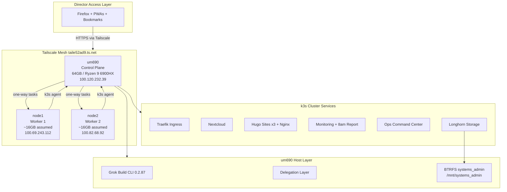
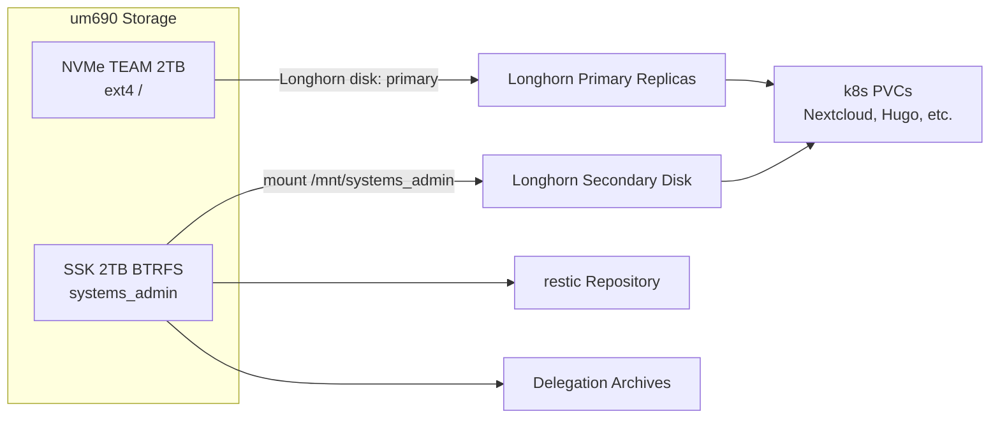
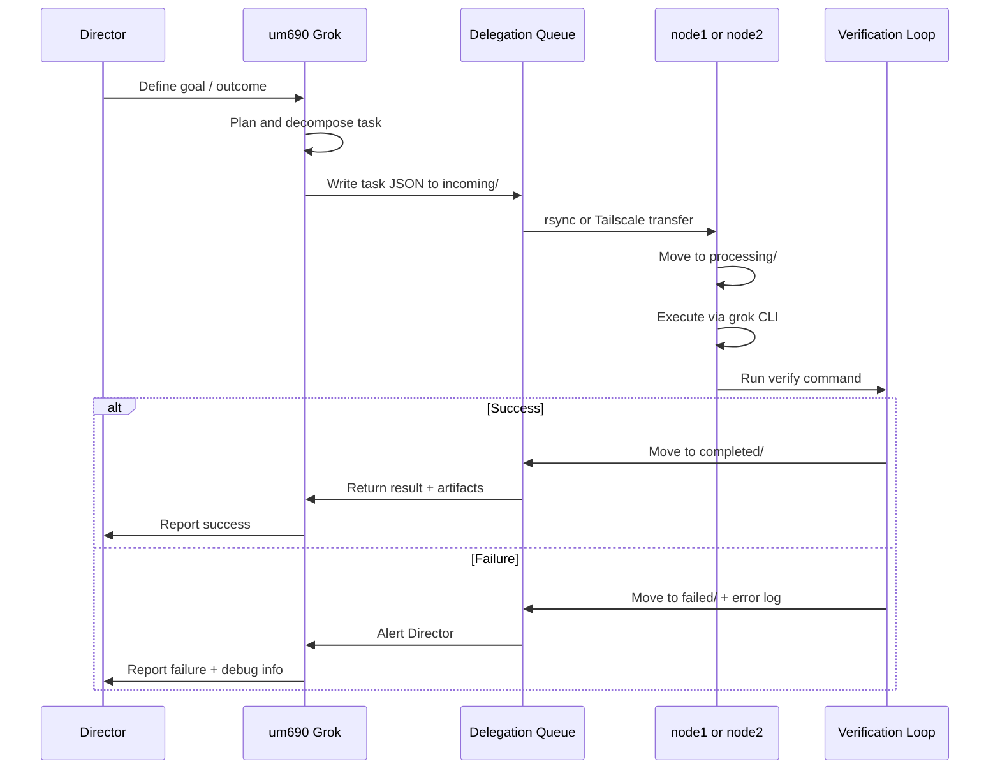

# DESIGN — SMADP / GrokOS

> [!summary] TL;DR
> Self-hosted cloud on 3 nodes (um690 + node1 + node2). k3s + Longhorn + Grok delegation. Josh decides **what**; Grok does **how**.

> [!success] Build status (8 Jul 2026)
> **Phases 0–6 complete.** See [[phases/Build-Complete]] · [[user-guide/README]]

> [!note] Format
> Obsidian ADHD style → [[user-guide/ADHD-Obsidian-Style]]

| | |
|---|---|
| **Spec** | [[specs/cluster]] |
| **Daily cmds** | [[user-guide/README]] |
| **Executor** | Grok Build CLI + xAI APIs (only non-sovereign part) |

---

## 1. Executive Summary

SMADP is a **sovereign, self-hosted cloud platform** that functions as both a professional desktop computing environment and a production-grade small-business infrastructure platform. It enables system/network/cloud administration, DevOps, Hugo website hosting (up to 3 sites), and intelligent automation — all orchestrated through a Director → Grok delegation model.

**Core Operating Model**:
- **Josh** defines goals and desired outcomes.
- **Grok** acts as Web Master, Admin, and Task Executor — planning, implementing, and verifying sub-tasks.

**Core Principle**: Maximum Technological & Economic Sovereignty.

> The **only** non-sovereign component is Grok / xAI APIs. All other services must be fully self-hosted.

### Current State (updated 8 July 2026)

> [!success] Operational
> 3-node k3s v1.36 · Longhorn · Nextcloud (HTTPS) · Traefik · Valley Tech site · Ops Center · delegation · restic backups · daily health reports

| Layer | URL / path |
|-------|------------|
| Ops hub | https://um690.taile52ad9.ts.net/ops/ |
| Nextcloud | https://um690.taile52ad9.ts.net/ |
| Valley Tech | https://um690.taile52ad9.ts.net/vts/ |
| Longhorn | https://um690.taile52ad9.ts.net/longhorn/ |

3-node cluster: **um690** (control), **node1** + **node2** (workers). See [[specs/cluster]] · [[user-guide/Services]].

---

## 2. Vision

A clean, reliable, browser-accessible sovereign platform that feels like a professional desktop while providing robust infrastructure for personal and professional use.

**Key Goals**:
- Run core services inside Kubernetes (k3s + Longhorn) across a 3-node mesh
- Use Grok Build CLI as the primary automation and execution engine
- Enable full delegation of web development, content management, and operations to Grok
- Maintain a simple, maintainable, and auditable system
- Support future migration from xAI APIs to open-source models

---

## 3. Scope & Constraints

### In Scope (v3.0)

- 3-node k3s cluster with Longhorn distributed storage
- Nextcloud as central file hub
- Hugo website hosting & management (up to 3 sites)
- Grok-powered task delegation system (one-way with verification)
- Browser-based Ops Command Center (Firefox + PWAs)
- Basic monitoring + daily 8am health reporting to Nextcloud
- Simple backup strategy (restic + rsync)
- Secure mesh networking via Tailscale

### Out of Scope (initial build)

- Local LLM inference (Open WebUI + Ollama) — deferred
- Full GitOps (ArgoCD) — can be added later
- Advanced service mesh or multi-cluster
- Self-hosted Headscale — Tailscale SaaS already active

### Constraints

- Heterogeneous hardware: 1 strong control plane (um690, 64 GB, 16 threads) + 2 lighter workers (node1 TBD, node2 16 GB / 4 threads)
- All services run inside k3s where practical
- Delegation layer runs on the host (not inside Kubernetes)
- Docker coexists for dev workflows; k3s uses its own embedded containerd
- Keep complexity low — prefer simple, reliable solutions

---

## 4. Technology Stack

| Layer | Technology | Location | Notes |
|-------|-----------|----------|-------|
| **Orchestration** | k3s + Longhorn | All nodes | Primary platform layer |
| **AI / Automation** | Grok Build CLI + xAI APIs | Host (all nodes) | Main execution engine |
| **Task Delegation** | Custom file-based system | Host | Verification loop |
| **File Storage** | Nextcloud | k3s | Central hub |
| **Ingress** | Traefik | k3s | k3s default ingress |
| **Static Websites** | Hugo + Nginx | k3s | Fully managed by Grok |
| **Networking** | Tailscale | All nodes | Mesh VPN (SaaS) |
| **Dashboard** | Notus Svelte (Tailwind) | k3s | Ops Command Center |
| **Backups** | restic + rsync | Host | BTRFS secondary target |
| **Monitoring** | Basic + Daily Report | k3s | 8am report to Nextcloud |

---

## 5. Architecture Overview

### 5.1 Mesh Topology



### 5.2 Node Roles

| Node | Tailscale IP | DNS | Role | Hardware |
|------|-------------|-----|------|----------|
| **um690** | 100.120.232.39 | um690.taile52ad9.ts.net | k3s server (control plane + etcd) | Ryzen 9 6900HX, 64 GB, 2×2 TB — see [`specs/cluster.md`](specs/cluster.md) §3 |
| **node1** | 100.69.243.112 | node1.taile52ad9.ts.net | k3s agent (worker) | **Offline** — scan pending, see §4 |
| **node2** | 100.82.68.92 | node2.taile52ad9.ts.net | k3s agent (worker) | i5-4570T, 16 GB, 238 GB SSD — see §5 |

**Auxiliary peers** (not k8s nodes): `hickles` (online Linux), `a-lap` (offline laptop), mobile devices — used for Director client access only.

### 5.3 Storage Architecture



| Device | Mount | Longhorn Tag | Purpose |
|--------|-------|-------------|---------|
| `nvme0n1p2` | `/` | `primary` (default) | OS, k3s, container images, hot replicas |
| `sda1` (BTRFS) | `/mnt/systems_admin` | `secondary` | Cold replicas, restic repo, delegation archives |

### 5.4 Delegation Flow



**Delegation is strictly one-way**: Control Plane (um690) initiates. Workers (node1, node2) execute. Workers never delegate upstream.

### 5.5 Service Map (k3s)

All services run in dedicated namespaces:

| Namespace | Service | Replicas | Storage |
|-----------|---------|----------|---------|
| `ingress` | Traefik | 1 (DaemonSet) | — |
| `nextcloud` | Nextcloud + MariaDB | 1 each | Longhorn PVC |
| `websites` | Hugo build + Nginx (×3 sites) | 1 per site | Longhorn PVC |
| `monitoring` | Health collector + CronJob | 1 | — |
| `ops-center` | Notus Svelte dashboard | 1 | — |
| `longhorn-system` | Longhorn | 3 (per node) | Host disks |

---

## 6. Key Decisions

| # | Decision Area | Final Decision | Rationale |
|---|--------------|----------------|-----------|
| 1 | Control plane host | `um690` (Minisforum UM690, 64 GB) | Strongest node; always-on; scanned and confirmed |
| 2 | Worker nodes | `node1` + `node2` (Tailscale Linux peers) | Already in mesh; named for infrastructure |
| 3 | AI layer | Grok Build CLI + xAI APIs | Only non-sovereign component; already installed on um690 |
| 4 | Delegation direction | Strictly one-way (um690 → workers) | Simplicity + control |
| 5 | Service deployment | All services inside k3s | Consistency & manageability |
| 6 | Delegation layer | Runs on host at `/opt/sovereign/delegation/` | Direct access to `grok` CLI |
| 7 | Primary storage | NVMe ext4 (existing root) | 1.8 TB free; lowest latency for hot data |
| 8 | Secondary storage | BTRFS `systems_admin` at `/mnt/systems_admin` | 1.9 TB unmounted; snapshots suit backups |
| 9 | Ingress | Traefik (k3s bundled) | Zero extra install; k3s default |
| 10 | Web server for Hugo | Nginx in k3s behind Traefik | Static serving; Grok manages content |
| 11 | Mesh VPN | Tailscale SaaS (existing) | Already configured; MagicDNS active |
| 12 | Docker coexistence | Keep Docker for dev; k3s uses embedded containerd | Both already on um690; no conflict |
| 13 | Cluster bootstrap | 2-node (um690 + node2) first; add node1 when online | node1 offline; node2 reachable at 1 ms LAN latency |
| 19 | node2 replica policy | Max 1 Longhorn replica per volume on node2 | i5-4570T / 4-thread CPU; 238 GB disk |
| 14 | Git strategy | GitHub primary | Low day-to-day Git usage |
| 15 | UI access | Firefox + PWAs + Notus Svelte | Familiar & low maintenance |
| 16 | Backups | restic to BTRFS + rsync offsite | Reliability over complexity |
| 17 | Monitoring | Basic health checks + daily 8am report to Nextcloud | Low overhead |
| 18 | Auth (future) | Vaultwarden | Bitwarden snap already on um690 |

---

## 7. Directory Structure

```
~/SovereignAid/
├── DESIGN.md                 # This document
├── specs/
│   └── cluster.md            # Full cluster inventory (all nodes)
├── scripts/
│   ├── phase0/               # Hardening, mount, UFW
│   ├── phase1/               # k3s install, Longhorn
│   ├── delegation/           # Watcher, processor, verifier
│   └── backup/               # restic, rsync
├── k8s/
│   ├── namespaces/
│   ├── nextcloud/
│   ├── websites/
│   ├── monitoring/
│   └── ops-center/
└── delegation/
    └── templates/            # Task JSON templates

/opt/sovereign/delegation/     # On ALL nodes (host-level)
├── incoming/
├── processing/
├── completed/
└── failed/
```

---

## 8. Delegation Task Schema

Every delegated task is a JSON file placed in `incoming/`:

```json
{
  "id": "550e8400-e29b-41d4-a716-446655440000",
  "version": "1.0",
  "created": "2026-07-06T08:00:00-07:00",
  "source": "um690",
  "target": "node1",
  "title": "Build and deploy hugo-site-1",
  "command": "cd /opt/sovereign/sites/site1 && hugo --minify && kubectl apply -f /opt/sovereign/k8s/websites/site1/",
  "verify": "kubectl get pods -n websites -l app=site1 -o jsonpath='{.items[0].status.phase}' | grep -q Running",
  "timeout_sec": 3600,
  "retries": 2,
  "notify": "nextcloud://reports/delegation/"
}
```

**Processor rules**:
1. Watcher polls `incoming/` every 30 seconds.
2. Atomic move to `processing/` before execution.
3. Run `command` with timeout; capture stdout/stderr.
4. Run `verify` — exit 0 = success.
5. Move to `completed/` or `failed/` with result JSON.
6. On failure with retries remaining, re-queue to `incoming/`.

---

## 9. Implementation Phases

### Phase 0: Foundation

**Goal**: Harden all nodes, mount storage, scaffold directories.

| Task | Node(s) | Acceptance Criteria |
|------|---------|-------------------|
| Bring node1 online and update `specs/cluster.md` §4 | node1 | node1 hardware section complete |
| Mount BTRFS `systems_admin` → `/mnt/systems_admin` | um690 | `sudo bash scripts/phase0/setup-nas-fstab.sh` then `verify-nas-mount.sh` passes; 22,410 files intact |
| Configure UFW (allow SSH, Tailscale k8s API) | all | `ufw status` shows active rules |
| SSH hardening (key-only, no root login) | all | `PasswordAuthentication no` in sshd_config |
| Install fail2ban | all | Service active |
| Create `/opt/sovereign/delegation/` tree | all | Directories exist with correct permissions |
| Create `~/SovereignAid/` scaffold | um690 | Directory structure per §7 |
| Verify Tailscale connectivity | all | `tailscale ping` succeeds between all 3 nodes |

### Phase 1: Kubernetes Base

**Goal**: Running 3-node k3s cluster with Longhorn.

| Task | Node(s) | Acceptance Criteria |
|------|---------|-------------------|
| Install k3s server on um690 | um690 | `kubectl get nodes` shows um690 Ready |
| Install k3s agents on node1, node2 | node1, node2 | Both nodes show Ready |
| Deploy Longhorn via Helm | um690 | Longhorn UI accessible; all 3 nodes report healthy |
| Tag um690 NVMe as `primary` Longhorn disk | um690 | Longhorn node settings confirmed |
| Tag um690 BTRFS as `secondary` Longhorn disk | um690 | Secondary disk visible in Longhorn |
| Create namespaces | um690 | `ingress`, `nextcloud`, `websites`, `monitoring`, `ops-center` exist |
| Validate PVC provisioning | um690 | Test PVC binds and mounts |

### Phase 2: Core Platform Services

**Goal**: Nextcloud, Traefik, basic monitoring operational.

| Task | Acceptance Criteria |
|------|-------------------|
| Deploy Traefik ingress | `kubectl get ingressclass` shows traefik |
| Deploy Nextcloud + MariaDB | Accessible at `https://nextcloud.um690.taile52ad9.ts.net` |
| Configure Tailscale HTTPS / DNS | Services reachable from Director laptop via mesh |
| Deploy basic health collector | Pod running in `monitoring` namespace |

### Phase 3: Grok Delegation System

**Goal**: Host-level task delegation with verification loop.

| Task | Acceptance Criteria |
|------|-------------------|
| Install Grok CLI on node1, node2 | `grok --version` succeeds on all nodes (node2: not yet installed) |
| Deploy watcher/processor systemd units | Services active on all nodes |
| Implement verification loop | Test task completes end-to-end um690 → node1 |
| Create control-plane task scripts | `scripts/delegation/create-task.sh` works |

### Phase 4: Hugo Websites & Automation

**Goal**: Up to 3 Hugo sites built and served.

| Task | Acceptance Criteria |
|------|-------------------|
| Scaffold 3 Hugo sites | Site repos in `k8s/websites/` |
| Deploy Nginx per site | Each site serves via Traefik ingress |
| Grok content workflow | Delegated build+deploy task succeeds with verification |
| DNS/ingress routes | All 3 sites accessible via Tailscale |

### Phase 5: Operations & Reliability

**Goal**: Backups and daily health reporting.

| Task | Acceptance Criteria |
|------|-------------------|
| Initialize restic repo on BTRFS | `restic snapshots` lists initial snapshot |
| Backup script (k8s etcd, PVCs, configs) | Cron job runs; snapshot created |
| rsync offsite target configured | Weekly rsync to external target |
| Daily 8am health report CronJob | Report appears in Nextcloud `/reports/` |
| Basic alerting on failure | Failed delegation tasks notify Director |

### Phase 6: User Experience Layer

**Goal**: Browser-first operations dashboard.

| Task | Acceptance Criteria |
|------|-------------------|
| Deploy Notus Svelte Ops Command Center | Dashboard accessible via Traefik |
| Firefox PWA setup | Nextcloud, Ops Center, Longhorn as PWAs |
| Bookmark collection | All services bookmarked in Firefox |
| Optional: Vaultwarden in k8s | Password manager self-hosted (if desired) |

---

## 10. Security & Privacy

| Area | Approach |
|------|----------|
| Network access | All admin via Tailscale; no public ingress |
| Firewall | UFW active; only SSH (22) and Tailscale interfaces |
| k8s API | Bound to Tailscale IP; `--tls-san` includes Tailscale DNS |
| Secrets | k8s Secrets for service credentials; host-level `.env` for Grok API keys |
| Router admin | Grok on um690 only — SSH to VyOS via dedicated key; see `specs/network.md` §4 |
| SSH | Key-only auth; fail2ban on all nodes |
| Backups | restic encrypted repository on BTRFS |
| Tailscale ACLs | Restrict k8s API to admin devices |
| Data sovereignty | All data on-premises; only Grok API calls leave the mesh |

---

## 11. Observability

| Signal | Method | Destination |
|--------|--------|-------------|
| Node health | `kubectl get nodes`, `df`, `free` | Daily 8am report |
| Pod health | `kubectl get pods -A` | Daily 8am report |
| Longhorn health | Longhorn API status | Daily 8am report |
| Delegation tasks | `completed/` and `failed/` counts | Daily 8am report |
| Backup status | restic snapshot age | Daily 8am report |
| Alerting | Failed task → log + optional Nextcloud notification | Immediate |

---

## 12. Key Operating Principles

- **Director Model**: You define *what*. Grok handles *how*.
- **Verification First**: Every task must include a success verification command.
- **One-Way Delegation**: Control Plane initiates. Workers execute.
- **Sovereignty First**: Minimize external dependencies.
- **Simplicity Preferred**: Favor reliable, maintainable solutions over complex ones.
- **Browser-First Access**: Primary interaction via Firefox over Tailscale.
- **Hardware-Grounded**: Design decisions reference scanned specs, not assumptions.

---

## 13. How to Use This Document

1. Start with **Phase 0** — scan worker nodes, harden, mount storage.
2. Implement one phase at a time; verify acceptance criteria before proceeding.
3. Reference [`specs/cluster.md`](specs/cluster.md) for per-node hardware constraints.
4. Use the delegation task schema (§8) for all automated workflows.
5. After each phase, Director reviews output and provides feedback.

---

## 14. Open Questions

| # | Question | Options | Default if Unresolved |
|---|----------|---------|----------------------|
| 1 | node1 hardware — host offline at scan | Power on and re-scan | node2 confirmed 16 GB; node1 still unknown |
| 2 | Hugo site domains | Tailscale MagicDNS subdomains vs custom DNS | `siteN.um690.taile52ad9.ts.net` |
| 3 | rsync offsite target | External USB, cloud bucket, or hickles | Defer to Phase 5; local restic first |
| 4 | Vaultwarden timing | Phase 6 or later | Phase 6 optional |
| 5 | node1 offline — 2-node vs 3-node bootstrap | Wait for node1 vs start um690+node2 | Bootstrap um690+node2 as 2-node cluster; add node1 when online |
| 6 | node2 LVM unallocated space (~135 GB) | Extend root LV vs dedicated `longhorn-lv` | Dedicated `longhorn-lv` for Longhorn disk |

---

## 15. Alternatives Considered

| Alternative | Why Not Chosen |
|-------------|----------------|
| **k8s (full) instead of k3s** | Heavier resource footprint; k3s is purpose-built for edge/homelab |
| **Self-hosted Headscale** | Tailscale SaaS already active and working; adds operational burden |
| **Docker Compose instead of k8s** | Doesn't scale to 3-node mesh; no native storage orchestration |
| **Ceph instead of Longhorn** | Far more complex; overkill for 3-node homelab |
| **ArgoCD from day one** | Premature; manual kubectl/helm sufficient for initial build |
| **Local LLM now** | Deferred; Grok API sufficient; um690 GPU available when needed |

---

## 16. PR Plan

Incremental, independently deployable pull requests (or equivalent change sets):

| PR | Title | Files / Components | Depends On |
|----|-------|-------------------|------------|
| **PR-0a** | Cluster spec | `specs/cluster.md` | — |
| **PR-0b** | node1 scan + update cluster spec §4 | `specs/cluster.md` | PR-0a |
| **PR-0c** | Foundation hardening | `scripts/phase0/`, UFW, fstab, `/opt/sovereign/` | PR-0a |
| **PR-1a** | k3s server on um690 | `scripts/phase1/install-k3s-server.sh` | PR-0c |
| **PR-1b** | k3s agents on workers | `scripts/phase1/install-k3s-agent.sh` | PR-1a, PR-0b |
| **PR-1c** | Longhorn deployment | `k8s/longhorn/`, Helm values | PR-1b |
| **PR-2a** | Traefik + namespaces | `k8s/namespaces/`, ingress config | PR-1c |
| **PR-2b** | Nextcloud stack | `k8s/nextcloud/` | PR-2a |
| **PR-2c** | Basic monitoring | `k8s/monitoring/` | PR-2a |
| **PR-3** | Delegation system | `scripts/delegation/`, systemd units | PR-0c |
| **PR-4** | Hugo sites (×3) | `k8s/websites/` | PR-2a, PR-3 |
| **PR-5** | Backups + daily report | `scripts/backup/`, CronJob | PR-2b, PR-0c |
| **PR-6** | Ops Command Center + PWAs | `k8s/ops-center/` | PR-2a |

---

## 17. Next Steps

1. ~~Write `specs/cluster.md` (um690 + node2 scanned, node1 pending)~~ — **Complete**
2. ~~Replace DESIGN.md with v3.0 hardware-grounded plan~~ — **Complete**
3. **Begin Phase 0**: Bring node1 online, pin BTRFS mount, configure UFW, scaffold directories
4. **Begin Phase 1**: Install k3s on um690 (single-node bootstrap), add workers, deploy Longhorn
5. Iterate through Phases 2–6 with Josh review between each

---

#sovereignaid #design #smadp #grokos