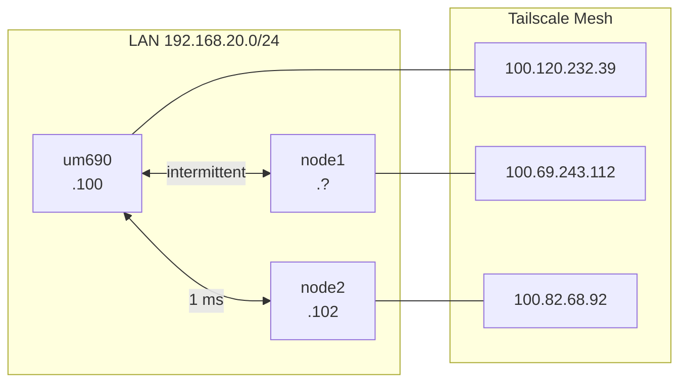
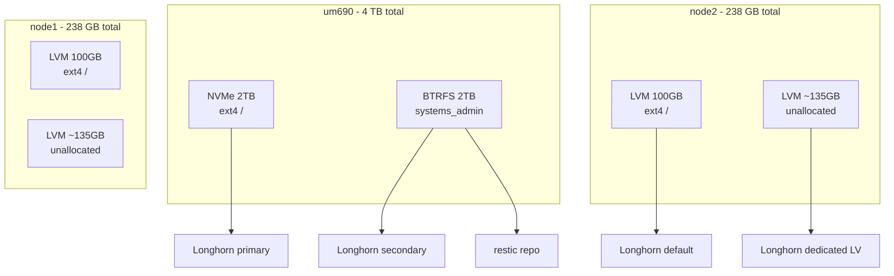

# Cluster Spec — SMADP

> [!summary] TLDR
> **um690** = control (64 GB, k3s server). **node1** + **node2** = workers. k3s + Longhorn **operational**. Ops hub: https://um690.taile52ad9.ts.net/ops/

> [!todo] Gaps
> - [x] node1 full hardware scan (§4) — 7 Jul 2026
> - [x] Grok CLI on node1 + node2 — v0.2.87
> - [x] UFW all nodes
> - [x] `/opt/sovereign/delegation/` all nodes

**Tailnet:** `taile52ad9.ts.net` · **Design:** [[SovereignAid/user/DESIGN]]

---

## 1. Cluster Summary

| Node | Role | Host | CPU | RAM | Primary Storage | LAN IP | Tailscale IP | Scan Status |
|------|------|------|-----|-----|-----------------|--------|--------------|-------------|
| **um690** | Control Plane | Minisforum UM690 | Ryzen 9 6900HX (8c/16t) | 64 GB | 2 TB NVMe + 2 TB BTRFS | 192.168.20.100 | 100.120.232.39 | Complete |
| **node1** | Worker 1 | Lenovo ThinkCentre M93p | i5-4570T (2c/4t) | 16 GB | 238 GB SSD (100 GB allocated) | 192.168.20.101 | 100.69.243.112 | Complete |
| **node2** | Worker 2 | Lenovo ThinkCentre M93p | i5-4570T (2c/4t) | 16 GB | 238 GB SSD (100 GB allocated) | 192.168.20.102 | 100.82.68.92 | Complete |

### Cluster Totals (known hardware)

| Resource | um690 | node1 | node2 | Cluster Total |
|----------|-------|-------|-------|---------------|
| CPU threads | 16 | 4 | 4 | 24 |
| RAM | 64 GB | 16 GB | 16 GB | 96 GB |
| Fast storage | 2 TB NVMe | 100 GB | 100 GB | 2.2 TB |
| Bulk storage | 2 TB BTRFS | — | — | 2 TB |

### Cluster Readiness

| Prerequisite | um690 | node1 | node2 |
|-------------|-------|-------|-------|
| Ubuntu 26.04 LTS | Ready | Ready | Ready |
| Tailscale online | Ready | Ready (DERP) | Ready |
| Grok Build CLI | Ready (v0.2.87) | Ready (v0.2.87) | Ready (v0.2.87) |
| Docker | Ready | — | — |
| k3s v1.36 | **Ready (server)** | **Ready (agent)** | **Ready (agent)** |
| Longhorn | Ready | Ready | Ready |
| UFW configured | Ready | Ready | Ready |
| SSH reachable from um690 | Local | Ready (Tailscale OK) | Ready |

> [!success] Platform (Jul 2026)
> Nextcloud · Traefik · Valley Tech · Ops Center · delegation watcher · restic on BTRFS
> Services: [[user-guide/Services]]

---

## 2. Network Topology

| Node | LAN Interface | LAN IP | Tailscale IPv4 | Tailscale DNS |
|------|--------------|--------|----------------|---------------|
| um690 | `eno1` (Intel I225-V 2.5GbE) | 192.168.20.100/24 | 100.120.232.39 | um690.taile52ad9.ts.net |
| node1 | `eno1` (Intel I217-LM) | 192.168.20.101/24 | 100.69.243.112 | node1.taile52ad9.ts.net |
| node2 | `eno1` (Intel I217-LM) | 192.168.20.102/24 | 100.82.68.92 | node2.taile52ad9.ts.net |

**Gateway**: 192.168.20.1 (VyOS — see [[specs/network]] for audit)  
**Home subnet**: 192.168.10.0/24 (segmented from lab)

---

## 3. Node: um690 (Control Plane)

### 3.1 Identity

| Field | Value |
|-------|-------|
| Hostname | um690 |
| Role | k3s server (control plane + etcd) |
| Manufacturer | Micro Computer (HK) Tech Limited |
| Model | Minisforum UM690 |
| Board | Shenzhen Meigao F7BFC v1.0 |
| BIOS | AMI 1.16 (2023-02-15) |
| Machine ID | `2781452fd50544dd9e4adbde39597643` |
| Chassis | Desktop (bare metal) |

### 3.2 CPU

| Field | Value |
|-------|-------|
| Model | AMD Ryzen 9 6900HX with Radeon Graphics |
| Cores / Threads | 8 / 16 |
| Max Frequency | 4937 MHz |
| Virtualization | AMD-V |
| Governor | `performance` |
| L3 Cache | 16 MiB |

### 3.3 Memory

| Field | Value |
|-------|-------|
| Total RAM | 62,454,948 kB (~59.6 GiB, 64 GB installed) |
| Swap | 8 GiB (`/swap.img`) |
| Available (at scan) | ~55 GiB |

### 3.4 GPU

| Field | Value |
|-------|-------|
| Model | AMD Radeon 680M (Rembrandt integrated) |
| PCI | `35:00.0 [1002:1681]` |

Reserved for future local LLM phase. Not used by SMADP v1.

### 3.5 Storage

| Device | Size | FS | Label/UUID | Mount | Purpose |
|--------|------|----|------------|-------|---------|
| `nvme0n1p1` | 1 GB | vfat | `6A6E-C6EA` | `/boot/efi` | EFI |
| `nvme0n1p2` | 1.9 TB | ext4 | `a52b728d-...` | `/` | OS, k3s, Longhorn primary |
| `sda1` | 1.9 TB | btrfs | `systems_admin` | `/run/media/kraken/systems_admin` (udisks auto) | Backup, Longhorn secondary |

| Disk Model | Connection | Rotational |
|-----------|------------|------------|
| TEAM TM8FPW002T (2 TB NVMe) | PCIe NVMe (MAXIO MAP1602) | SSD |
| SSK Storage (2 TB) | USB 3.x (ASMedia ASM2464) | SSD |

**Root usage**: 21 GB / 1.9 TB (2%)  
**NAS usage**: 122 GB / 1.9 TB (7%) — 22,410 files, 2,363 directories  
**NAS contents**: `Backups/` (38 GB), `batocera_management/` (85 GB), `HICKMAN_ROOT/` (2.2 GB), `Pictures/` (6.3 MB), `.snapshots/`  
**BTRFS status**: Auto-mounted via udisks2 — permanent fstab pending (`scripts/phase0/setup-nas-fstab.sh`)  
**Planned mount**: `/mnt/systems_admin` via UUID `59f59772-7098-43f2-ab85-3c0794931a14`

### 3.6 Network Interfaces

| Interface | State | MAC | Address |
|-----------|-------|-----|---------|
| `eno1` | UP | `58:47:ca:70:aa:02` | 192.168.20.100/24 |
| `wlp3s0` | DOWN | `10:6f:d9:76:56:9d` | WiFi 6E (MT7921K) |
| `tailscale0` | UP | — | 100.120.232.39/32 |
| `docker0` | DOWN | — | 172.17.0.1/16 |

### 3.7 Operating System

| Field | Value |
|-------|-------|
| OS | Ubuntu 26.04 LTS (resolute) |
| Kernel | 7.0.0-27-generic |
| Timezone | America/Los_Angeles (PDT) |
| NTP | chrony (synchronized) |
| IP forwarding | Enabled |

### 3.8 Software

| Component | Version | Status |
|-----------|---------|--------|
| Grok Build CLI | 0.2.87 (stable) | Installed |
| Docker CE | 29.6.1 | Installed, running |
| containerd | 2.2.5 | Running |
| Tailscale | 1.98.8 | Running |
| OpenSSH | 10.2p1 | Running |
| Git | 2.53.0 | Installed |
| Python | 3.14.4 | Installed |
| UFW | 0.36.2 | Installed, **inactive** |
| k3s / kubectl | — | Not installed |

### 3.9 Security Posture

| Control | Status |
|---------|--------|
| UFW | Inactive |
| SSH | Open on 0.0.0.0:22 |
| AppArmor | Enabled (default) |
| fail2ban | Not installed |
| `kernel.dmesg_restrict` | 1 |
| `kernel.kptr_restrict` | 1 |

### 3.10 Longhorn Disk Plan

| Disk | Tag | Path |
|------|-----|------|
| NVMe (`nvme0n1p2` host) | `primary` | `/var/lib/longhorn/` on ext4 root |
| BTRFS (`sda1`) | `secondary` | `/mnt/systems_admin/longhorn/` (after permanent mount) |

---

## 4. Node: node1 (Worker 1)

### 4.1 Identity

| Field | Value |
|-------|-------|
| Hostname | node1 |
| Role | k3s agent (worker) |
| Manufacturer | Lenovo |
| Model | ThinkCentre M93p |
| SKU | LENOVO_MT_10AB |
| BIOS | FBKTDBAUS (2019-12-24) |
| Machine ID | `55ecbaab6d444cb49159c41c13a984d1` |
| Chassis | Desktop (bare metal) |
| Tailscale DNS | node1.taile52ad9.ts.net |

### 4.2 CPU

| Field | Value |
|-------|-------|
| Model | Intel Core i5-4570T @ 2.90 GHz |
| Cores / Threads | 2 / 4 |
| Max Frequency | 3600 MHz |
| Virtualization | VT-x |
| L3 Cache | 4 MiB |

**Note**: Same CPU class as node2. Suitable for lightweight worker workloads and delegated tasks.

### 4.3 Memory

| Field | Value |
|-------|-------|
| Total RAM | ~15 GiB (16 GB installed) |
| Swap | 4 GiB (`/swap.img`) |
| Available (at scan) | ~14 GiB |

### 4.4 GPU

| Field | Value |
|-------|-------|
| Model | Intel HD Graphics (4th Gen Xeon E3-1200 integrated) |
| PCI | `00:02.0 [8086:0412]` |

Headless worker node. No compute value for SMADP.

### 4.5 Storage

| Device | Size | FS | Mount | Notes |
|--------|------|----|-------|-------|
| `sda1` | 1 GB | vfat | `/boot/efi` | EFI |
| `sda2` | 2 GB | ext4 | `/boot` | Boot |
| `sda3` → LVM | 235 GB | LVM2 | — | Physical volume |
| `ubuntu-vg/ubuntu-lv` | 100 GB | ext4 | `/` | Root (8% used) |

| Disk Model | Total | Allocated | Unallocated in VG |
|-----------|-------|-----------|-------------------|
| SK hynix SC311 SATA SSD | 238.5 GB | 100 GB LVM | ~135 GB |

**Opportunity**: Same as node2 — extend `ubuntu-lv` or create `longhorn-lv` from ~135 GB unallocated space.

### 4.6 Network Interfaces

| Interface | State | Address |
|-----------|-------|---------|
| `eno1` | UP | 192.168.20.101/24 |
| `wlp2s0` | DOWN | Centrino Wireless-N 105 |
| `tailscale0` | UP | 100.69.243.112/32 |

**Latency to um690**: <1 ms LAN (when SSH stable). Tailscale uses DERP relay when direct path unavailable.

### 4.7 Operating System

| Field | Value |
|-------|-------|
| OS | Ubuntu 26.04 LTS (resolute) |
| Kernel | 7.0.0-27-generic |
| Architecture | x86_64 |

### 4.8 Software

| Component | Version | Status |
|-----------|---------|--------|
| Tailscale | 1.98.8 | Running |
| OpenSSH | 10.2p1 | Running (`ssh.service` active, `ssh.socket` inactive) |
| Git | 2.53.0 | Installed |
| Python | 3.14.4 | Installed |
| UFW | 0.36.2 | Installed, **inactive** |
| Grok Build CLI | 0.2.87 | **Installed** (7 Jul 2026) |
| Docker | — | **Not installed** |
| k3s | — | **Not installed** |

### 4.9 Security Posture

| Control | Status |
|---------|--------|
| UFW | Inactive |
| SSH | Open on 0.0.0.0:22 |
| fail2ban | Not installed |

### 4.10 Longhorn Disk Plan

| Disk | Tag | Recommendation |
|------|-----|----------------|
| `ubuntu-lv` (ext4, 100 GB) | `default` | Use for k3s + container images |
| Unallocated LVM (~135 GB) | `worker-storage` | Create `longhorn-lv` LV for dedicated Longhorn disk |

**Replica policy**: Limit Longhorn replicas on node1 to 1 per volume (same as node2).

### 4.11 Connectivity Notes (7 Jul 2026)

| Check | Status |
|-------|--------|
| LAN ping | PASS (<1 ms) |
| LAN SSH | **Intermittent** — port 22 sometimes refused; use `ssh node1-ts` fallback |
| Tailscale SSH | PASS |
| SSH mesh verify | PASS when node1 SSH up |

> **Watch item**: node1 SSH intermittency — **suspected IP conflict** (ARP `20:15:de` ≠ eno1 `d8:cb:8a`). See [[specs/network]] §2.3.  
> Recovery: `sudo bash recover-node1-ssh.sh` on node1 console; fix VyOS DHCP reservation.

---

## 5. Node: node2 (Worker 2)

### 5.1 Identity

| Field | Value |
|-------|-------|
| Hostname | node2 |
| Role | k3s agent (worker) |
| Manufacturer | Lenovo |
| Model | ThinkCentre M93p |
| SKU | LENOVO_MT_10AB (10AB0016US) |
| BIOS | FBKTD8AUS (2019-09-17) |
| Machine ID | `a3653b7d633b4a9d9624336f4f47b76e` |
| Chassis | Desktop (bare metal) |

### 5.2 CPU

| Field | Value |
|-------|-------|
| Model | Intel Core i5-4570T @ 2.90 GHz |
| Cores / Threads | 2 / 4 |
| Max Frequency | 3600 MHz |
| Virtualization | VT-x |
| L3 Cache | 4 MiB |

**Note**: Significantly less powerful than um690. Suitable for lightweight worker workloads, Hugo builds, and delegated tasks. Not ideal for heavy storage replicas — prefer um690 for primary Longhorn replicas.

### 5.3 Memory

| Field | Value |
|-------|-------|
| Total RAM | ~15 GiB (16 GB installed) |
| Swap | 4 GiB (`/swap.img`) |
| Available (at scan) | ~14 GiB |

### 5.4 GPU

| Field | Value |
|-------|-------|
| Model | Intel HD Graphics (4th Gen Xeon E3-1200 integrated) |
| PCI | `00:02.0 [8086:0412]` |

No compute value for SMADP. Headless worker node.

### 5.5 Storage

| Device | Size | FS | Mount | Notes |
|--------|------|----|-------|-------|
| `sda1` | 1 GB | vfat | `/boot/efi` | EFI |
| `sda2` | 2 GB | ext4 | `/boot` | Boot |
| `sda3` → LVM | 235 GB | LVM2 | — | Physical volume |
| `ubuntu-vg/ubuntu-lv` | 100 GB | ext4 | `/` | Root (9% used) |

| Disk Model | Total | Allocated | Unallocated in VG |
|-----------|-------|-----------|-------------------|
| SK hynix SC311 SATA SSD | 238.5 GB | 100 GB LVM | ~135 GB |

**Opportunity**: Extend `ubuntu-lv` or create a second LV (`longhorn-lv`) from ~135 GB unallocated space for dedicated Longhorn disk.

### 5.6 Network Interfaces

| Interface | State | Address |
|-----------|-------|---------|
| `eno1` | UP | 192.168.20.102/24 |
| `wlp2s0` | DOWN | Centrino Wireless-N 105 |
| `tailscale0` | UP | 100.82.68.92/32 |

**Latency to um690**: 1 ms (same LAN subnet)

### 5.7 Operating System

| Field | Value |
|-------|-------|
| OS | Ubuntu 26.04 LTS (resolute) |
| Kernel | 7.0.0-27-generic |
| Architecture | x86_64 |

### 5.8 Software

| Component | Version | Status |
|-----------|---------|--------|
| Tailscale | 1.98.8 | Running |
| OpenSSH | 10.2p1 | Running |
| Git | 2.53.0 | Installed |
| Python | 3.14.4 | Installed |
| chrony | 4.8 | Installed |
| UFW | 0.36.2 | Installed, **inactive** |
| Grok Build CLI | 0.2.87 | **Installed** (7 Jul 2026) |
| Docker | — | **Not installed** |
| k3s | — | **Not installed** |

### 5.9 Security Posture

| Control | Status |
|---------|--------|
| UFW | Inactive |
| SSH | Open on 0.0.0.0:22 |
| fail2ban | Not installed |

### 5.10 Longhorn Disk Plan

| Disk | Tag | Recommendation |
|------|-----|----------------|
| `ubuntu-lv` (ext4, 100 GB) | `default` | Use for k3s + container images |
| Unallocated LVM (~135 GB) | `worker-storage` | Create `longhorn-lv` LV for dedicated Longhorn disk |

**Replica policy**: Limit Longhorn replicas on node2 to 1 per volume due to limited CPU and disk.

---

## 6. Cluster Software Matrix

| Software | um690 | node1 | node2 | Required By |
|----------|-------|-------|-------|-------------|
| Ubuntu 26.04 LTS | Yes | ? | Yes | Phase 0 |
| Tailscale | Yes | ? | Yes | Phase 0 |
| OpenSSH | Yes | ? | Yes | Phase 0 |
| Grok Build CLI | Yes | Yes | Yes | Phase 3 |
| Docker CE | Yes | ? | No | Optional (dev only) |
| k3s server | No | — | — | Phase 1 |
| k3s agent | — | ? | No | Phase 1 |
| kubectl | No | — | — | Phase 1 |
| Helm | No | — | — | Phase 1 |
| UFW (configured) | No | No | No | Phase 0 |
| fail2ban | No | ? | No | Phase 0 |

---

## 7. Cluster Storage Strategy

| Tier | Node | Disk | Capacity | Purpose |
|------|------|------|----------|---------|
| Hot | um690 | NVMe | 1.8 TB free | OS, k3s, primary Longhorn replicas |
| Warm | um690 | BTRFS | 1.9 TB | Secondary replicas, restic, delegation archives |
| Worker | node2 | LVM (extend) | ~135 GB available | Longhorn worker disk |
| Worker | node1 | LVM (extend) | ~135 GB available | Longhorn worker disk |

---

## 8. Cluster Readiness Checklist

| # | Item | um690 | node1 | node2 |
|---|------|-------|-------|-------|
| 1 | Hardware scanned | PASS | PASS | PASS |
| 2 | Ubuntu 26.04 installed | PASS | PASS | PASS |
| 3 | LAN connectivity | PASS | PASS (ping) | PASS |
| 4 | Tailscale online | PASS | PASS | PASS |
| 5 | SSH from um690 | PASS | PARTIAL (intermittent) | PASS |
| 6 | Grok CLI installed | PASS | PASS | PASS |
| 7 | k3s installed | FAIL | FAIL | FAIL |
| 8 | UFW configured | PASS | PASS | PASS |
| 9 | Longhorn disk identified | PARTIAL | PARTIAL | PARTIAL |
| 10 | Delegation dirs created | PASS | PASS | PASS |

**Phase 0 gate**: **PASSED** (7 Jul 2026). Proceed to Phase 1: `sudo bash scripts/phase1/run-phase1.sh`

---

## 9. SSH Mesh Status

| Node | LAN IP | ~/.ssh/config | ssh.service | ssh.socket | verify-ssh-mesh.sh |
|------|--------|---------------|-------------|------------|-------------------|
| um690 | 192.168.20.100 | Installed | enabled/active | **still enabled** | Partial — needs `sudo bash setup-ssh-mesh.sh` |
| node1 | 192.168.20.101 | Installed | enabled/active | disabled | **All pass** |
| node2 | 192.168.20.102 | Installed | enabled/active | disabled | **All pass** |

**Connectivity** (LAN): all pairs working at ~160–310ms.

**um690 remaining**: run updated `setup-ssh-mesh.sh` to install sshd/client drop-ins and mask `ssh.socket`.

**node1 recovery**: original script stopped `ssh.socket` before `ssh.service` was running, briefly killing SSH. Fixed script uses safe start-first order. If SSH dies again: `sudo bash recover-node1-ssh.sh` on node1 console.

**Navigation commands** (`/usr/local/bin/`): `control` → um690, `node1`, `node2` — all use `ssh <host>` which now resolves via LAN `~/.ssh/config`.

Verify: `bash ~/SovereignAid/scripts/phase0/verify-ssh-mesh.sh`

---

## 10. Open Items

1. ~~**node1 scan**~~ — Complete 7 Jul 2026. Watch intermittent LAN SSH.
2. ~~**node2 Grok CLI**~~ — v0.2.87 installed. k3s prep next (Phase 1).
3. **node2 LVM extension** — Allocate ~135 GB unallocated space for Longhorn.
4. **um690 BTRFS permanent mount** — Run `sudo bash scripts/phase0/setup-nas-fstab.sh` (preserves all data; remount only). Verify with `scripts/phase0/verify-nas-mount.sh`.
5. **Replica sizing** — node2's i5-4570T / 4-thread CPU warrants conservative Longhorn replica and pod scheduling limits.
6. **Privileged scan** — `dmidecode`, `smartctl`, `lvs/vgs` with sudo for DIMM speeds and SMART health on all nodes.

---

## 11. Scan Methodology

| Node | Method | Elevation |
|------|--------|-----------|
| um690 | Local read-only commands | User (no sudo) |
| node2 | SSH remote commands from um690 | User (no sudo) |
| node1 | SSH remote from um690 (LAN + Tailscale) | User (no sudo) |

Commands used: `lscpu`, `free -h`, `lsblk`, `df`, `hostnamectl`, `lspci`, `ip`, `ss`, `systemctl`, `dpkg -l`, `tailscale status`, `tailscale ping`, `ssh`.

**Re-scan trigger**: Run Phase 0 node1 bring-up, then update §4 from a full `ssh kraken@node1` inventory.

---

#sovereignaid #specs #cluster #hardware